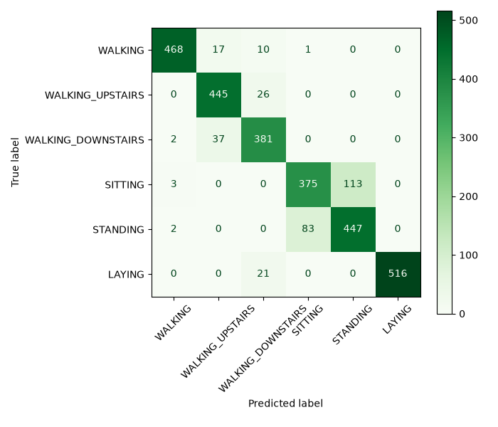

# 02 - IoT & Intelligence artificielle

**Vidéo (démo + explication technique) :** https://youtu.be/q_jO7KO53Fk

## Objectif du projet

Reproduire sur PC la chaîne de traitement qui tournerait normalement sur un objet connecté (type
ESP32) pour reconnaître un mouvement à partir de données d'accéléromètre/gyroscope : préparation des
données, entraînement d'un modèle léger, export au format Edge AI (TensorFlow Lite), et simulation
de l'arrivée des données d'un capteur en temps réel, sans matériel physique.

## Dataset

**UCI HAR** (Human Activity Recognition Using Smartphones) : 30 volontaires portant un smartphone à
la taille, accéléromètre + gyroscope à 50 Hz, 6 activités (WALKING, WALKING_UPSTAIRS,
WALKING_DOWNSTAIRS, SITTING, STANDING, LAYING). Le dataset fournit déjà les signaux découpés en
fenêtres de 128 échantillons (2,56 s, chevauchement 50 %) et un split train/test séparé par sujet
(21 sujets en train, 9 en test, aucun en commun).

On utilise les **9 signaux bruts** (`Inertial Signals/`, dossier `body_acc_*`, `body_gyro_*`,
`total_acc_*`), pas les 561 caractéristiques précalculées fournies par ailleurs dans le dataset :
un capteur monté sur un ESP32 ne fournirait jamais de caractéristiques déjà calculées, seulement des
valeurs brutes.

- Source : [UCI Machine Learning Repository : Human Activity Recognition Using Smartphones](https://archive.ics.uci.edu/dataset/240/human+activity+recognition+using+smartphones)
- Référence : Anguita, D., Ghio, A., Oneto, L., Parra, X., Reyes-Ortiz, J.L. (2013). *A Public Domain
  Dataset for Human Activity Recognition Using Smartphones*. ESANN.

## Installation

- Python 3.12.3 (TensorFlow ne supporte officiellement Python 3.12 que depuis sa version 2.16).

```bash
cd 02-IoT-Intelligence-Artificielle
python3 -m venv venv
source venv/bin/activate
pip install -r requirements.txt
```

Téléchargement du dataset (non versionné, trop volumineux) :

```bash
mkdir -p data/raw && cd data/raw
curl -sL -o uci_har.zip "https://archive.ics.uci.edu/static/public/240/human+activity+recognition+using+smartphones.zip"
unzip uci_har.zip
unzip "UCI HAR Dataset.zip"
rm uci_har.zip "UCI HAR Dataset.zip"
cd ../..
```

Après extraction, la structure attendue est `data/raw/UCI HAR Dataset/...`.

Pour ouvrir et exécuter les notebooks (VS Code + extension Jupyter, ou `jupyter lab`), le kernel du
`venv` doit être enregistré une fois :

```bash
python -m ipykernel install --user --name=rattrapage-iot --display-name "Python (rattrapage-iot)"
```

## Utilisation

Les notebooks se lancent dans l'ordre (chacun réutilise les fichiers `models/*.json` produits par le
précédent, jamais les valeurs recalculées à la volée) :

1. `notebooks/01_exploration.ipynb` : inspection des données brutes.
2. `notebooks/02_preprocessing.ipynb` : split train/validation par sujet, normalisation.
3. `notebooks/03_training.ipynb` : entraînement du CNN 1D, sauvegarde `models/model.keras`.
4. `notebooks/04_evaluation_export.ipynb` : évaluation sur le test, export TFLite float32/int8.

Simulation d'un flux de capteur IoT (fichier de démo fourni) :

```bash
python src/simulate_sensor.py --speed 10
```

Options : `--file` (CSV à utiliser), `--model` (`.tflite` à charger), `--speed` (accélération par
rapport au temps réel), `--step` (fréquence des prédictions), `--uncertain-threshold`.

Mesure de la taille et du temps d'inférence des modèles exportés :

```bash
python src/benchmark.py
```

## Préparation des données

Le fenêtrage (128 échantillons, chevauchement 50 %) est déjà fait par les auteurs du dataset : il
n'a pas été refait ici. Ce qui a été fait dans `02_preprocessing.ipynb` :

- **Split validation par sujet** : 5 des 21 sujets du train (1, 27, 25, 3, 15) mis de côté pour la
  validation, jamais mélangés avec les 16 sujets d'entraînement réel, même logique que le split
  train/test du dataset, pour éviter qu'une fenêtre d'une personne se retrouve à la fois dans les
  données servant à ajuster le modèle et dans celles servant à vérifier ses progrès.
- **Normalisation** : moyenne et écart-type calculés uniquement sur les fenêtres d'entraînement réel
  (5551 fenêtres), sauvegardés dans `models/normalization.json` et réutilisés à l'identique pour la
  validation, le test, et la simulation IoT.

## Architecture du modèle

CNN 1D à 7686 paramètres (30 Ko en float32) :

| Couche | Sortie | Paramètres |
|---|---|---|
| Conv1D (16 filtres, k=5) | (128, 16) | 736 |
| Conv1D (32 filtres, k=5) | (128, 32) | 2592 |
| MaxPooling1D | (64, 32) | 0 |
| Conv1D (32 filtres, k=3) | (64, 32) | 3104 |
| GlobalAveragePooling1D | (32,) | 0 |
| Dense (32, relu) | (32,) | 1056 |
| Dropout (0.3) | (32,) | 0 |
| Dense (6, softmax) | (6,) | 198 |

**Pourquoi un CNN 1D :** il capte les motifs qui se répètent dans le temps (un pas de marche), a peu
de paramètres, et a un chemin de quantification int8 simple et mature dans TensorFlow Lite. Un LSTM
est techniquement supporté par TensorFlow Lite Micro (`unidirectional_sequence_lstm.cc`), mais avec
des contraintes fortes : seule la variante standard du LSTM est prise en charge, et sa version
quantifiée exige un format d'état interne particulier (int16), plus délicat à obtenir qu'un CNN
entièrement quantifié en int8 comme celui-ci.
`GlobalAveragePooling1D` plutôt qu'un `Flatten` réduit fortement le nombre de paramètres de la
couche dense qui suit.

## Résultats

Sur le test (2947 fenêtres, 9 sujets jamais vus à l'entraînement) :

- **Accuracy : 0.893**
- **F1 macro : 0.893**



**Analyse des confusions :**
- **SITTING / STANDING** est la confusion la plus importante (113 + 83 fenêtres) : ces deux postures
  produisent un signal d'accélération quasi identique en amplitude (~0.92g contre ~1.02g, vu dès
  l'exploration), difficile à distinguer pour un capteur porté à la taille.
- **WALKING_UPSTAIRS / WALKING_DOWNSTAIRS** (26 + 37 fenêtres) : oscillation périodique similaire
  dans les deux sens de déplacement.
- **LAYING** est presque parfaitement reconnu (recall 0.96, precision 1.00) : la position allongée
  change complètement l'orientation du capteur par rapport à la gravité, très distincte des autres
  activités.

## Export et contraintes embarquées

| Version | Taille | Accuracy | F1 macro |
|---|---|---|---|
| `model.keras` | 132.0 Ko | 0.8931 | 0.8930 |
| `model_float32.tflite` | 36.3 Ko | 0.8931 | 0.8930 |
| `model_int8.tflite` | 17.7 Ko | 0.8928 | 0.8926 |

La quantification int8 divise la taille par plus de 7 par rapport au format Keras, pour une perte
d'accuracy de 0.0004, négligeable.

**Temps d'inférence** (mesuré avec `src/benchmark.py`, 1000 inférences, CPU x86_64 de développement,
**pas représentatif d'un ESP32**, seulement utile pour comparer les deux versions entre elles) :

| Version | Moyenne | p95 |
|---|---|---|
| `model_float32.tflite` | 0.013 ms | 0.013 ms |
| `model_int8.tflite` | **0.005 ms** | 0.005 ms |

## Pertinence sur microcontrôleur

Un ESP32 classique dispose de 520 Ko de SRAM, d'un CPU dual-core jusqu'à 240 MHz, et d'une flash
externe souvent de 4 Mo selon le module (la flash n'est pas intégrée à la puce elle-même, sa taille
dépend donc du module exact). Le modèle
`model_int8.tflite` (17.7 Ko) tient très largement dans la flash, et le tensor arena nécessaire à
l'exécution (mémoire de travail pour les activations intermédiaires) reste modeste pour un réseau
aussi petit (7686 paramètres). Le déploiement réel se ferait via `esp-tflite-micro`, le composant
officiel maintenu par Espressif pour utiliser TensorFlow Lite for Microcontrollers sous ESP-IDF.

**Optimisations déjà appliquées :** quantification int8.

**Optimisations supplémentaires envisageables :**
- Réduire encore le nombre de filtres (voir `research/experiment_smaller_cnn.py`) : une version à
  2182 paramètres (filtres divisés par deux) a obtenu une accuracy de **validation** encore meilleure
  (98.45 % contre 97.33 %), mais n'a pas été évaluée sur le test ni réintégrée dans l'export/la
  simulation faute de temps avant la deadline. Piste sérieuse pour une itération future.
- Fenêtre plus courte ou fréquence d'échantillonnage réduite.
- Noyaux optimisés ESP-NN (bibliothèque d'opérateurs accélérés pour microcontrôleurs Espressif).

Sources : [ESP32 Series Datasheet, v5.3](https://documentation.espressif.com/esp32_datasheet_en.pdf) (520 KB SRAM, CPU jusqu'à 240 MHz),
[TensorFlow Lite / LiteRT : post-training quantization](https://developers.google.com/edge/litert/performance/post_training_quantization),
[esp-nn (Espressif)](https://github.com/espressif/esp-nn).

## Limites

- Données collectées avec un smartphone à la taille, pas un capteur ESP32 réel : l'emplacement, le
  bruit et la fréquence exacte d'un vrai capteur embarqué pourraient différer.
- 30 sujets seulement : le modèle n'a pas vu une grande diversité de morphologies/façons de bouger.
- Confusion connue et observée en simulation entre SITTING et STANDING pour certains sujets.
- Le temps d'inférence mesuré est celui d'un PC, pas d'un ESP32 : seule la comparaison relative
  entre float32 et int8 est exploitable ici, pas la valeur absolue.

## Recherches et sources

- [UCI HAR, page officielle du dataset](https://archive.ics.uci.edu/dataset/240/human+activity+recognition+using+smartphones) (Samsung Galaxy S II, 30 sujets, licence CC BY 4.0)
- Anguita et al. (2013), *A Public Domain Dataset for Human Activity Recognition Using Smartphones*, ESANN.
- [TensorFlow Lite / LiteRT : post-training quantization](https://developers.google.com/edge/litert/performance/post_training_quantization) (TensorFlow Lite a été rebaptisé LiteRT par Google ; l'API Python utilisée reste `tf.lite.*`)
- [ESP32 Series Datasheet, v5.3](https://documentation.espressif.com/esp32_datasheet_en.pdf) (Espressif), 520 KB SRAM, CPU dual-core jusqu'à 240 MHz
- [esp-nn (Espressif)](https://github.com/espressif/esp-nn) : jusqu'à 14x d'accélération sur des convolutions en int8
- [esp-tflite-micro (Espressif)](https://github.com/espressif/tflite-micro-esp-examples) : composant officiel TFLite Micro pour ESP-IDF
- [tflite-micro, unidirectional_sequence_lstm.cc](https://github.com/tensorflow/tflite-micro/blob/main/tensorflow/lite/micro/kernels/unidirectional_sequence_lstm.cc) : support LSTM limité à la variante standard, format de quantification int16 pour l'état interne

## Historique des essais

Voir [`research/`](research/) : choix du dataset argumenté, et une expérience sur une architecture
plus petite (résultat et décision détaillés dans `research/notes.md`).
